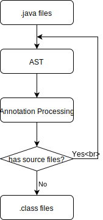

# Annotation Processing



Annotation processing allow us to play on AST.

## Define Processor

```java
public interface Processor {
  Set<String> getSupportedOptions();
  Set<String> getSupportedAnnotationTypes();
  SourceVersion getSupportedSourceVersion();
  void init(ProcessingEnvironment processingEnv);
  boolean process(Set<? extends TypeElement> annotations, RoundEnvironment roundEnv);
  Iterable<? extends Completion> getCompletions(Element element, AnnotationMirror annotation, ExecutableElement member, String userText);
}
```

## Register Processor

Annotation Processor use java SPI (Service Provider Interface) 

Your file structure

```text
MyProcessor.jar
  - com
    - example
      - MyProcessor.class
  - META-INF
    - services
      - javax.annotation.processing.Processor
```

`javax.annotation.processing.Processor`

```text
com.example.MyProcessor
```

## Processing

- `Messager`, create compiler warning/error
- `Filer`, create sources/resources