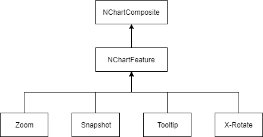

# CHD 3.0 Highlight

## PFM-6754 Custom Filtering


```sql
UPDATE pfc_gui_status
SET pfc_gui_status.value_number = -(ABS(pfc_gui_status.value_number) + 1), pfc_gui_status.value_string = 'SELECT TOP 50.0% HOTSPOTS RANKED BY focus_left ASC PER PATTERN OF TOP 10 RANKED BY MIN(focus_right) DESC'
WHERE (pfc_gui_status.name = 'Configurable Filtering');

UPDATE pfc_gui
INNER JOIN (SELECT ABS(pfc_gui_status.value_number) AS value
FROM pfc_gui_status
WHERE (pfc_gui_status.name = 'Configurable Filtering')) AS t_filter_flag
INNER JOIN (SELECT t_rank.key AS `key`
FROM (SELECT t_rank_value.*, @v_rank_value_0:=CASE WHEN @v_rank_group_0 = rank_group THEN @v_rank_value_0+1 ELSE 0 END AS `rank`, @v_rank_group_0:=rank_group
FROM (SELECT pfc_gui.id_pk AS `key`, pfc_gui.adel_pattern_id AS `rank_group`, 0+ 1 * pfc_gui.focus_left AS `value`
FROM pfc_gui
HAVING (`value` IS NOT NULL)
ORDER BY `rank_group`, `value` LIMIT 2147483646) AS t_rank_value, (SELECT @v_rank_group_0:=0) AS t_rank_group, (SELECT @v_rank_value_0:=-1) AS t_rank_rank) AS t_rank
INNER JOIN (SELECT pfc_gui.adel_pattern_id AS `count_group`, COUNT(*) AS `count`
FROM pfc_gui
WHERE ((0+ 1 * pfc_gui.focus_left) IS NOT NULL)
GROUP BY count_group) AS t_count ON t_rank.rank_group = t_count.count_group
WHERE (t_rank.rank < 0.5 * t_count.count AND t_rank.rank_group IN (SELECT t_per_rank.key AS `key`
FROM (SELECT t_per_rank_value.*, @v_per_rank_value:=@v_per_rank_value + 1 AS `rank`
FROM (SELECT pfc_gui.adel_pattern_id AS `key`, MIN(0+ 1 * pfc_gui.focus_right) AS `value`
FROM pfc_gui
GROUP BY pfc_gui.adel_pattern_id
HAVING (`value` IS NOT NULL)
ORDER BY `value` LIMIT 2147483646) AS t_per_rank_value, (SELECT @v_per_rank_value:=-1) AS t_per_rank_rank) AS t_per_rank, (SELECT COUNT(DISTINCT pfc_gui.adel_pattern_id) AS `count`
FROM pfc_gui
WHERE ((0+ 1 * pfc_gui.focus_right) IS NOT NULL)) AS t_per_count
WHERE (t_per_rank.rank >= t_per_count.count - 10)))) AS t_filter ON pfc_gui.id_pk = t_filter.key
SET pfc_gui.custom_filter = t_filter_flag.value;

UPDATE pfc_gui_status
SET pfc_gui_status.value_number = ABS(pfc_gui_status.value_number), pfc_gui_status.value_string = 'SELECT TOP 50.0% HOTSPOTS RANKED BY focus_left ASC PER PATTERN OF TOP 10 RANKED BY MIN(focus_right) DESC'
WHERE (pfc_gui_status.name = 'Configurable Filtering')
```

## PFM-8296 Statistic Overview


### Cache


### SQL calculate median

```sql
SELECT 
  t_count.count_group1 AS `detector_id`,
  t_count.count_group2 AS `pattern_id`,
  '$$' AS `property`,
  t_count.count AS `count`, 
  MIN(t_rank.value) AS `min`,
  MAX(t_rank.value) AS `max`, 
  AVG(t_rank.value) AS `mean`, 
  AVG(CASE WHEN ABS(t_rank.rank - t_count.count * .05 + .5) <= .5 THEN t_rank.value ELSE NULL END) AS `p5`,
  AVG(CASE WHEN ABS(t_rank.rank - t_count.count * .25 + .5) <= .5 THEN t_rank.value ELSE NULL END) AS `q1`, 
  AVG(CASE WHEN ABS(t_rank.rank - t_count.count * .5 + .5) <= .5 THEN t_rank.value ELSE NULL END) AS `q2`, 
  AVG(CASE WHEN ABS(t_rank.rank - t_count.count * .75 + .5) <= .5 THEN t_rank.value ELSE NULL END) AS `q3`,
  AVG(CASE WHEN ABS(t_rank.rank - t_count.count * .95 + .5) <= .5 THEN t_rank.value ELSE NULL END) AS `p95`
FROM (
  SELECT 
  t_rank_value.*, 
  @rank_value:=CASE WHEN @rank_group1 = rank_group1 AND @rank_group2 = rank_group2 THEN @rank_value+1 ELSE 0 END AS `rank`, 
  @rank_group1:=rank_group1, 
  @rank_group2:=rank_group2
  FROM (
    SELECT pfc_gui.detector_id AS `rank_group1`, pfc_gui.adel_pattern_id AS `rank_group2`, $$ AS `value`
    FROM pfc_gui
    WHERE ($$ IS NOT NULL)
    ORDER BY `rank_group1`, `rank_group2`, `value` LIMIT 2147483646
  ) AS t_rank_value, 
  (SELECT @rank_group1:=0, @rank_group2:=0) AS t_rank_group, 
  (SELECT @rank_value:=-1) AS t_rank_rank
) AS t_rank, 
(
  SELECT pfc_gui.detector_id AS `count_group1`, pfc_gui.adel_pattern_id AS `count_group2`, COUNT(*) AS `count`
  FROM pfc_gui
  WHERE ($$ IS NOT NULL)
  GROUP BY count_group1, count_group2
) AS t_count
WHERE (t_rank.rank_group1 = t_count.count_group1) AND (t_rank.rank_group2 = t_count.count_group2)
GROUP BY detector_id, pattern_id;
```

### NChart

- Pluggable     =>    Flexibility, Readability, Maintainability
- Style Sheet   =>    Flexibility, Readability, Maintainability
- Native        =>    Efficient
- Immutable     =>    Safety and Easy



```java
style(NBarChartStyle.builder()
    .barColor(0x99bb55)
    .barGap(0.5)
    .parent(NXYChartStyle.builder()
        .plotArea(NPlotAreaStyle.builder()
            .hGridColor(NColor.YELLOW.rgb)
            .build())
        .xAxis(NAxisStyle.builder()
            .font(NBarChartStyle.DEFAULT.parent.xAxis.font.toBuilder()
                .color(NColor.RED.rgb)
                .build())
            .width(5)
            .build())
        .build())
    .build());
```

#### X-Rotate


