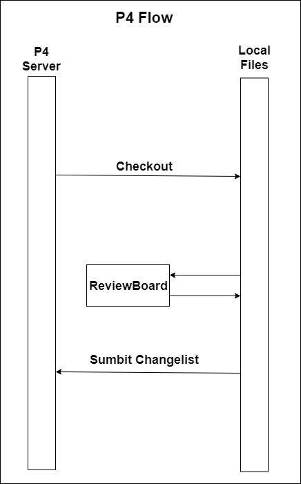
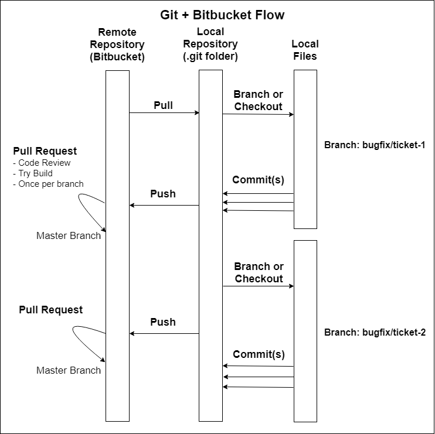
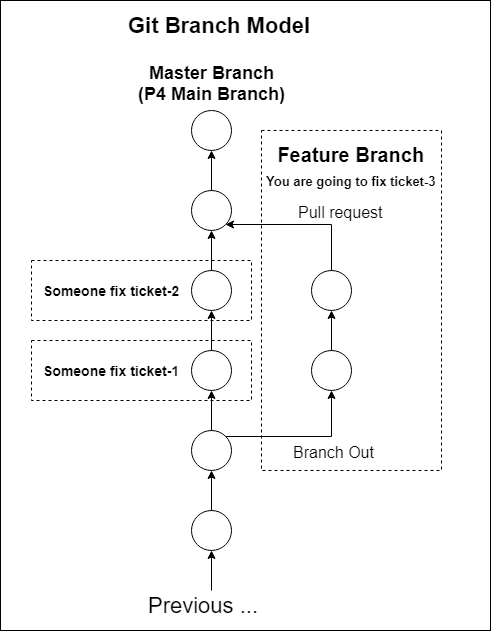
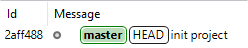
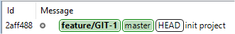
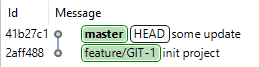
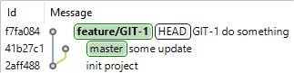
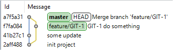
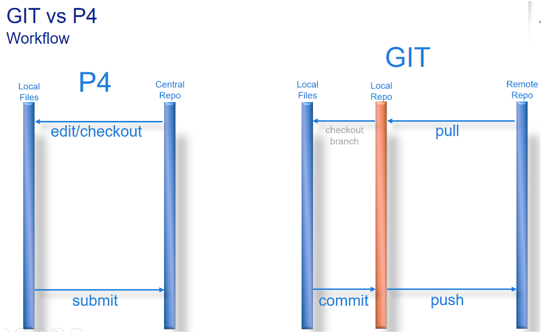

# Introduce

[Git Guide](https://git-scm.com/book/en/v2)

[Demo Project](https://git-brion-us.asml.com:8443/users/dxu/repos/git-demo/browse)

[Demo Project For Command](https://git-brion-us.asml.com:8443/users/dxu/repos/git-command-demo/browse)

[Git In Practice](https://git-brion-us.asml.com:8443/users/dxu/repos/git-in-practice/browse)

## Compare with Perforce

## Why Git?

- 70% developer
- 90% open source project

- distributed
- collaborate, branch model

## Basic Concept

### Repository

- a project
- a `.git` folder

### Commit

- a node in the commit tree
- record the 4 factors of VCS
- has 0 to n parent commit node
- has 0 to n child commit node

### Stage

### Branch and Merge

- a pointer to the commit tree
- usually is an independent develop process
- `HEAD`, a special pointer that direct to local branch you are currently on.

---
At the beginning, we have `master` branch

---
Create Branch `feature/GIT-1`

---
New change in `master` branch

---
New change in `feature/GIT-1` branch

---
Merge `feature/GIT-1` into `master`

### Remote

- A Git repository on server
- Default remote name is `origin` 

<!-- PAGE TABLE START -->

| Previous | Next |
| --- | --- |
| [Back to parent](.) | [Git Basic Commands](2-Basics.md) |

<!-- PAGE TABLE END -->
