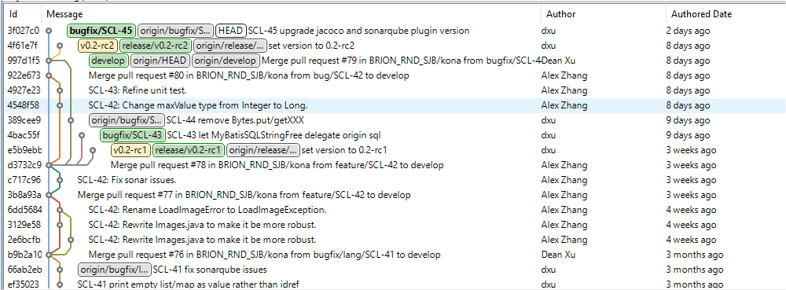

# Introduce

[Git Guide](https://git-scm.com/book/en/v2)

[Demo Project](https://git-brion-us.asml.com:8443/users/dxu/repos/git-demo/browse)

[Demo Project For Command](https://git-brion-us.asml.com:8443/users/dxu/repos/git-command-demo/browse)

[Git In Practice](https://git-brion-us.asml.com:8443/users/dxu/repos/git-in-practice/browse)

## Why Git?

- distributed
- collaborate, branch model

## Compare with Perforce

 

## Basic Concept

*A sample of git commit tree. Don't be afraid, you will know all the details after this part*

### Commit

- a node in the commit tree
- It records
  - Who
  - When
  - Why
  - What

### Stage

Git will track all the changes of your local files.

### Branch and Merge

- a pointer to the commit tree
- usually is an independent develop process
- `master`, every repository has a master branch, just like P4 main branch. It may has another name, like `tychyon-RDI-10` in PWE
- `HEAD`, a special pointer that direct to local branch you are currently on.

### Remote

A Git repository on server.

By default, the remote named `origin`.

<!-- PAGE TABLE START -->

| Previous | Next |
| --- | --- |
| [Back to parent](.) | [Git Basic Commands](2-Basics.md) |

<!-- PAGE TABLE END -->
