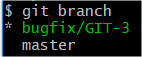
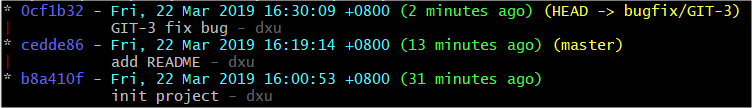
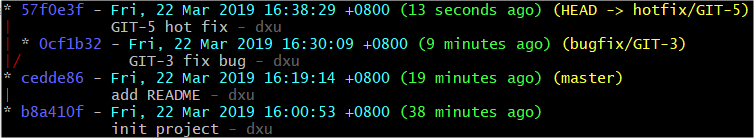
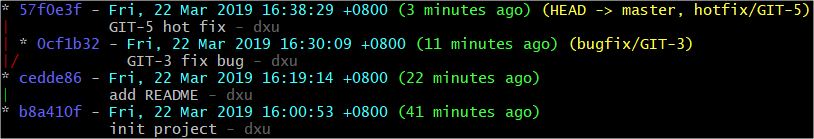
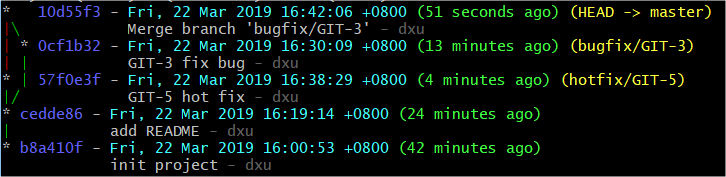
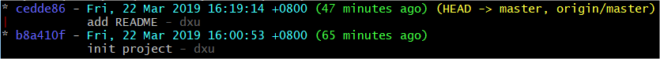
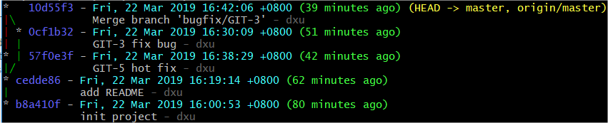
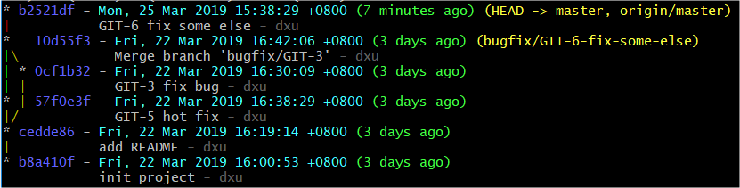
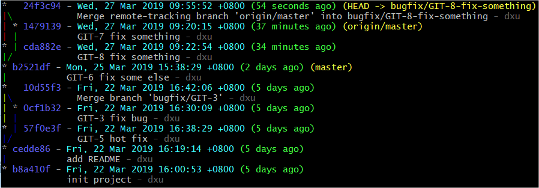

# Git Basic Commands

Don't afraid command line. Git command line is very easy and powerful.

For 99% cases, you only need to following commands:

- Commit
  - git add
  - git status
  - git commit
- Branch
  - git branch
  - git checkout
  - git merge
- Remote
  - git pull
  - git push

Even you don't need to know their parameters, because git will tell you.

## Repository

### New Project

- `git init`. Initialize current path to a git repository. It will create a hidden folder `.git` which save git's data.

### Exist Project from Remote

- `git clone https://git-brion-us.asml.com:8443/scm/~dxu/git-demo.git`. Clone a repository from remote url. It will create a folder named by the repository's name (here is `git-demo`) and download all data from remote repository. And the remote configuration is set up automatically (named `origin`).

`git clone url-to-remote/repo-name.git` is equals to following commands

- `mkdir repo-name`
- `cd repo-name`
- `git init`
- `git remote add origin url`
- `git pull`

## Stage and Commit

Suppose you are going to do some change.

You can use `git status` to see current git work tree and stage status

```
$ git status
On branch master
nothing to commit, working tree clean
```

Then you do some change. Then run `git status` agian, you can see it has been updated automatically!

```
$ echo 'Git Command Demo' > README.md

$ git status
On branch master
Untracked files:
  (use "git add <file>..." to include in what will be committed)

        README.md

nothing added to commit but untracked files present (use "git add" to track)
```

To commit the changed file, we can use `git add` command to add it onto stage. And then let's use `git status` to check it.

*You can use `git add .` to add all changed files at one time*

```
$ git add README.md

$ git status
On branch master
Changes to be committed:
  (use "git reset HEAD <file>..." to unstage)

        new file:   README.md
```

Our changes are ready. Let's use `git commit` command to commit our change. It will pop an editor to let you input commit message.

```
$ git commit

# Please enter the commit message for your changes. Lines starting
# with '#' will be ignored, and an empty message aborts the commit.
#
# On branch master
# Changes to be committed:
#       new file:   README.md
#
~
~
```

Now your commit is submitted to git tree.

To change and commit, you just need:

- git add .
- git commit

And use `git status` to check work tree status.


## Branch and Merge

Suppose you are going to fix a bug `GIT-3`.

Let's create a branch first

```
$ git branch
* master

$ git branch bugfix/GIT-3

$ git branch
  bugfix/GIT-3
* master

$ git checkout bugfix/GIT-3
Switched to branch 'bugfix/GIT-3'

$ git branch
* bugfix/GIT-3
  master
```



Branch `bugfix/GIT-3` has been created and now we are on it. Then, we can do our changes and commit.

```
$ echo 'fix' > git-3.source

$ git add .

$ git commit -m "GIT-3 fix bug"
[bugfix/GIT-3 0cf1b32] GIT-3 fix bug
 1 file changed, 1 insertion(+)
 create mode 100644 git-3.source
```



Everything looks good. But now an emergency issue comes, you need to fix `GIT-5` first. But you don't want to mixed `GIT-3` changes together. Fix `GIT-5` should be independent with fix `GIT-3`. Let's create a new branch and fix it. 

```
$ git checkout master
Switched to branch 'master'

$ git checkout -b hotfix/GIT-5
Switched to a new branch 'hotfix/GIT-5'

$ echo 'fix' > git-5.source

$ git add .

$ git commit -m "GIT-5 hot fix"
[hotfix/GIT-5 57f0e3f] GIT-5 hot fix
 1 file changed, 1 insertion(+)
 create mode 100644 git-5.source
```



We create a new branch from `master` branch point and commit our changes. Now we are going to merge all the fixing to master branch

```
$ git checkout master
Switched to branch 'master'

$ git merge hotfix/GIT-5
Updating cedde86..57f0e3f
Fast-forward
 git-5.source | 1 +
 1 file changed, 1 insertion(+)
 create mode 100644 git-5.source
```



First we merged `GIT-5` into `master`, it said 'Fast-forward'. 

Then, we try to merge `GIT-3` into `master`. 

```
$ git merge bugfix/GIT-3

Merge branch 'bugfix/GIT-3'

# Please enter a commit message to explain why this merge is necessary,
# especially if it merges an updated upstream into a topic branch.
#
# Lines starting with '#' will be ignored, and an empty message aborts
# the commit.
~
~

Merge made by the 'recursive' strategy.
 git-3.source | 1 +
 1 file changed, 1 insertion(+)
 create mode 100644 git-3.source
```



`GIT-3` has been merged. Git pop an editor to let us input merge message because the branches are not fast-forward.

Now we have both bug fixed in `master` branch.

*Note that in actual developing work flow, we should do merge on server(Bitbucket). This content is in next chapter.*

## Remote

Suppose you are another developer. You are going to fix `GIT-6`, but your local repository is still have old commits. 



Before start your ticket. You want(must) to get the newest code, you can use `git pull`.

*In fact, `git pull` is `git fetch` and `git merge`. If your local branch is not tracking, it will not do auto merge.*

```
$ git pull
From https://git-brion-us.asml.com:8443/scm/~dxu/git-command-demo
   cedde86..10d55f3  master     -> origin/master
Updating cedde86..10d55f3
Fast-forward
 git-3.source | 1 +
 git-5.source | 1 +
 2 files changed, 2 insertions(+)
 create mode 100644 git-3.source
 create mode 100644 git-5.source
```




After pull, your HEAD is on the latest commit. Now, let's do ourselves work.

```
$ echo 'fix it!' > git-6.source
$ git add .
$ git commit -m "GIT-6 fix some else"
[master b2521df] GIT-6 fix some else
 1 file changed, 1 insertion(+)
 create mode 100644 git-6.source
```

We have committed our changes, how can we publish our changes so that others can fetch them? You can use `git push`

```
$ git push
Enumerating objects: 4, done.
Counting objects: 100% (4/4), done.
Delta compression using up to 8 threads
Compressing objects: 100% (2/2), done.
Writing objects: 100% (3/3), 283 bytes | 283.00 KiB/s, done.
Total 3 (delta 1), reused 0 (delta 0)
To https://git-brion-us.asml.com:8443/scm/~dxu/git-command-demo.git
   10d55f3..b2521df  master -> master
```



Now you have pushed your change to remote.


## Conflict

Suppose you are working on `GIT-8` 

```java
$ git checkout -b bugfix/GIT-8-fix-something
Switched to a new branch 'bugfix/GIT-8-fix-something'

$ echo 'do work 2' > conflict.source

$ git add .

$ git commit -m "GIT-8 fix something"
[bugfix/GIT-8-fix-something cda882e] GIT-8 fix something
 1 file changed, 1 insertion(+)
 create mode 100644 conflict.source
```

Everything is OK until now. While you should confirm you are ahead `master` branch so that you can merge into `master` fast-forward.

*Note that `git pull <remote> <branch>` is abbreviation of `git fetch <remote>; git merge <remote>/<branch>`*

```
$ git pull origin master

remote: Enumerating objects: 4, done.
remote: Counting objects: 100% (4/4), done.
remote: Compressing objects: 100% (2/2), done.
remote: Total 3 (delta 1), reused 0 (delta 0)
Unpacking objects: 100% (3/3), done.
From https://git-brion-us.asml.com:8443/scm/~dxu/git-command-demo
 * branch            master     -> FETCH_HEAD
   b2521df..1479139  master     -> origin/master
Auto-merging conflict.source
CONFLICT (add/add): Merge conflict in conflict.source
Automatic merge failed; fix conflicts and then commit the result.
```

Oops, git told me it can't merge automatically and we need to resolve the conflict.

You can use `git status` to check conflict status

```
$ git status
On branch bugfix/GIT-8-fix-something
You have unmerged paths.
  (fix conflicts and run "git commit")
  (use "git merge --abort" to abort the merge)

Unmerged paths:
  (use "git add <file>..." to mark resolution)

        both added:      conflict.source

no changes added to commit (use "git add" and/or "git commit -a")
```

To resolve the conflict, the simplest way is to write the conflict file directly.

```
$ vi conflict.source

<<<<<<< HEAD
do work 2
=======
do work 1
>>>>>>> 1479139ac6c2750bf894b80aa5cfcbc7ad0629de
```

Or you can use `git mergetool` to do the merge with visual tool.

*You can use `git mergetool --tool-help` to check available tools*

```
$ git mergetool --tool=<tool> #e.g. <tool> can be vimdiff or p4merge
```

After merge, we can commit the merge change just like common changes

```
$ git add .

$ git commit  # Git will prepare merge commit message
```



<!-- PAGE TABLE START -->

| Previous | Next |
| --- | --- |
| [Introduce](1-Introduce.md) | [Git + Bitbucket + Jira WorkFlow](3-Workflow.md) |

<!-- PAGE TABLE END -->

