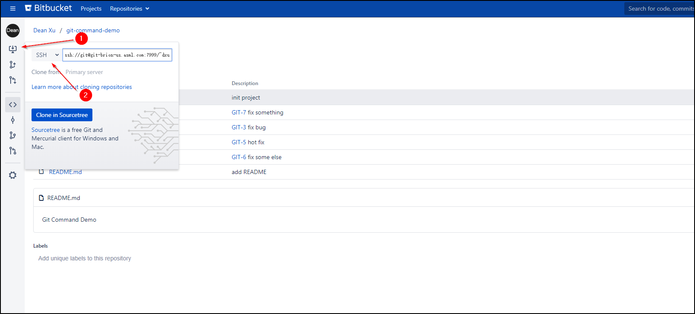
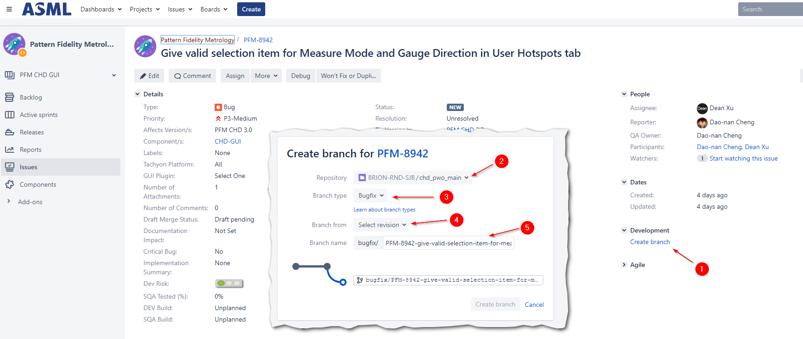
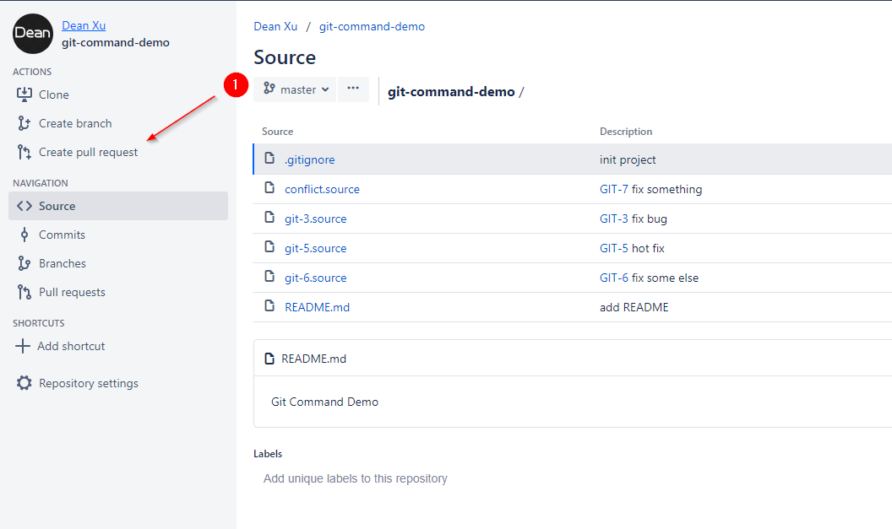
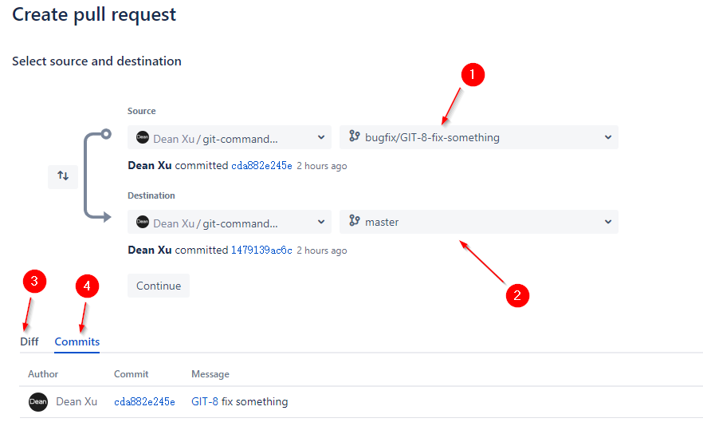
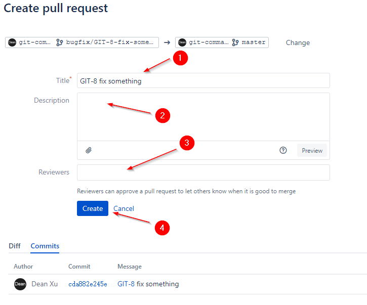
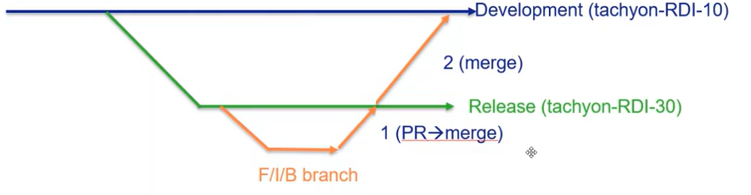
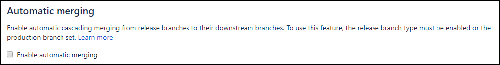
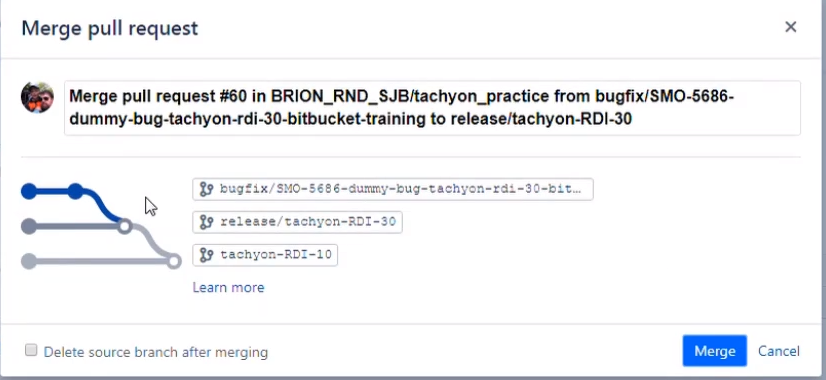

# Git + Bitbucket + Jira WorkFlow

## Checkout repository

### Get URL from Bitbucket



1. Click the button to checkout(clone) the repository
2. By default the url is `SSH`, but I prefer to use `HTTP`. To use `SSH`, you may need to [configure your public key](https://confluence.atlassian.com/bitbucketserver0514/using-bitbucket-server/controlling-access-to-code/using-ssh-keys-to-secure-git-operations/ssh-user-keys-for-personal-use).

### Clone in local

```
cd <your path>
git clone <your-url>
```

## Create branch

When a ticket comes, the first thing you should do is to create a branch. 

You can create branch on remote(Jira) or in local.

### Create branch on Jira

You can create a branch for the ticket on Jira



1. Click `create branch` on your ticket
2. Select correct repository
3. Select your change type, there are
  - Bugfix
  - Feature
  - Hotfix
  - Release
  - Custom
4. Select where you want to branch from. Usually it's `master` branch
5. Input your branch name. Usually the automatic name from ticket title is ok.

After the branch created, you can fetch and checkout it in local.

```
$ git fetch
From https://git-brion-us.asml.com:8443/scm/brion_rnd_sjb/chd_pwo_main
 * [new branch]          bugfix/PFM-8942-give-valid-selection-item -> origin/bugfix/PFM-8942-give-valid-selection-item

$ git checkout bugfix/PFM-8942-give-valid-selection-item 
Branch 'bugfix/PFM-8942-give-valid-selection-item' set up to track remote branch 'bugfix/PFM-8942-give-valid-selection-item' from 'origin'.
Switched to a new branch 'bugfix/PFM-8942-give-valid-selection-item'
```

### Create branch in local directly

In fact, Jira `create branch` is to help you create branch that match its convention. So we can create branch in local directly.

```
git checkout -b bugfix/PFM-8942-fix-something
```

## Do your change in local

Do your changes for the ticket in local. `add` and `commit` them. Note that each commit should starts with the ticket number.

## Push changes and create pull request

After fix the ticket in local, you can push your changes onto remote(Bitbucket).

```
$ git push
Enumerating objects: 9, done.
Counting objects: 100% (9/9), done.
Delta compression using up to 8 threads
Compressing objects: 100% (4/4), done.
Writing objects: 100% (6/6), 609 bytes | 203.00 KiB/s, done.
Total 6 (delta 2), reused 0 (delta 0)
remote:
remote: Create pull request for bugfix/GIT-8-fix-something:
remote:   https://git-brion-us.asml.com:8443/users/dxu/repos/git-command-demo/compare/commits?sourceBranch=refs/heads/bugfix/GIT-8-fix-something
remote:
To https://git-brion-us.asml.com:8443/scm/~dxu/git-command-demo.git
 * [new branch]      bugfix/GIT-8-fix-something -> bugfix/GIT-8-fix-something
Branch 'bugfix/GIT-8-fix-something' set up to track remote branch 'bugfix/GIT-8-fix-something' from 'origin'.
```

Then, open Bitbucket page to create pull request to check in your changes into `master` branch



1. Click the button to create pull request

 

1. Select source branch. The branch where your changes are.
2. Select target branch, usually is `master` branch.
3. You can review what changes before create the pull request
4. You can review which commits will be in the pull request
5. Click continue button



1. Input your pull request title. By default, it's your branch name
2. Input the description. You should describe what you change.
3. Input reviewers. By default, there are default reviewers for each repository configured by admin.
4. Click create button

Now your pull request has been created. After reviewer approved, you can merge it.

## Release branch work flow

For example, we have master branch (going to 2.0) and release/v1.0 branch.

- A  release branch `release/v1.0` will be created by SCM (or DEV leader)
  - If you are fixing a 1.0 bug
    - Branch out from `release/v1.0`
    - Do your changes
    - Create pull request from the `bugfix` branch into `release/v1.0`, DEV leader will approve and merge it
    - Create pull request from the `bugfix` branch into `master` branch just like normal work flow <sup>Note</sup>
  - If you are doing a 2.0 feature. You should branch out from `master`. Then create pull request from the `feature` branch to master branch just like `release/v1.0` not exist
  


*Note, If your repository has enabled `Auto merging`, this step will be completed automatically*




<!-- PAGE TABLE START -->

| Previous | Next |
| --- | --- |
| [Git Basic Commands](2-Basics.md) | [Introduce Bitbucket](4-Bitbucket.md) |

<!-- PAGE TABLE END -->
