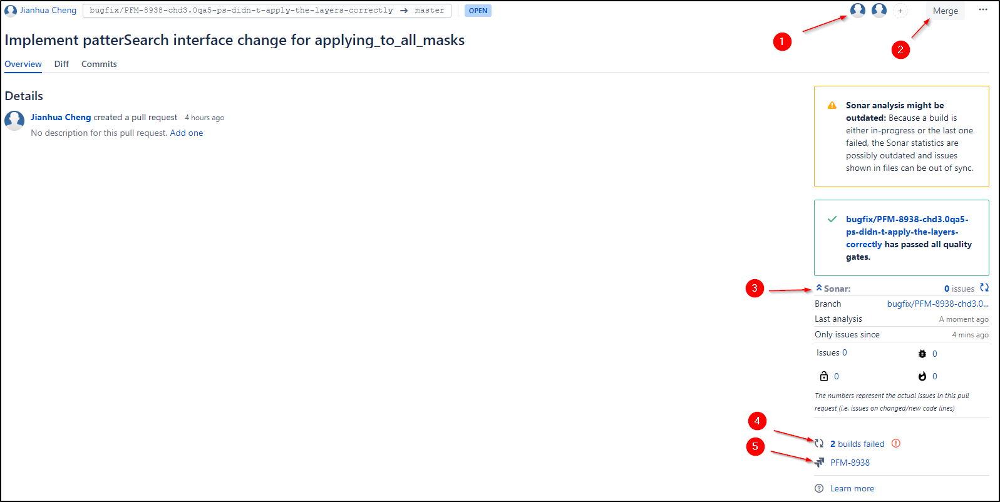

# Introduce Bitbucket

## Pull Request Page

Except basic informations, there are many other functions in a Bitbucket pull request page

1. Reviewer list
  - It will show who approved the pull request 
  - If you are reviewer, you can click button to approve/reject 
  - If you are not reviewer, you can click add button to add yourself as reviewer
2. Merge Button
  -  It will be disabled if there are merge check not pass, like reviewer not approve, task not resolve or merge conflict  
  - After click it, you are going to confirm the merge again. Notice that you prefer to check the `Delete...` box because a branch is useless after merge 
3. If your project are using Sonarqube, you can see the newly sonar issues here
4. Build of the pull requests
5. Related issue

Under the overview page, there is activity part. You can track the pull request changes and leave comments here

This is pull request diff page

1. You can review all changes or select specific commit to review
2. You can create inline comment on file or on line 
3. You can create task on inline comment
4. You can create related jira ticket on inline comment

## Branch Page

1. You current selected branch, also called base branch
2. The branch compare to base branch
3. The branch's related pull request state. Click to go into.
4. Click the branch name to compare the branch with base branch

## Setting Page

1. Give project member write permission
2. Protect master branch (maybe also release branch) from change without pull request
3. Add merge check, such as at least one reviewer approve
4. Select `Merge commit`
5. Add default reviewer

