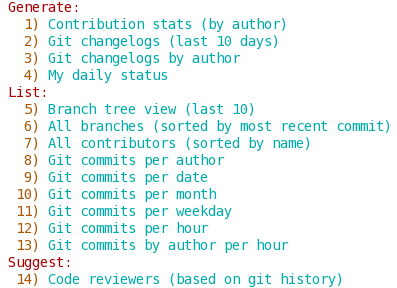
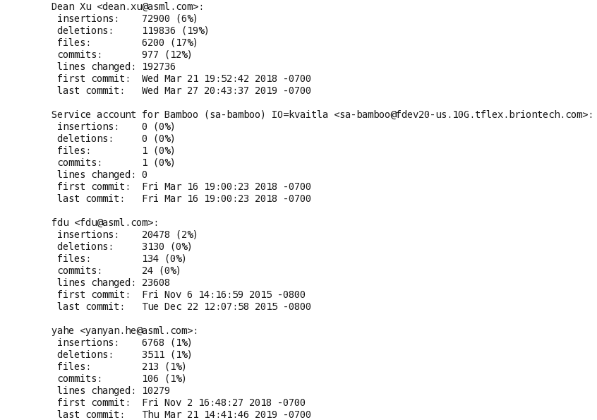
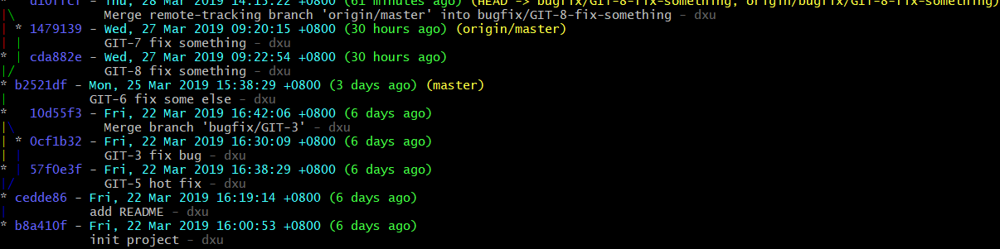

# Summary

## Convention

- Named your branch as bitbucket convention
  - feature/issue-1-what-feature
  - bugfix/issue-2-what-bug
  - hotfix/issue-3-what-fix
- Add ticket number before every commit
  - `git commit -m 'issue-4 do something'`

## Practice

- Do commit for each little piece
- Don't let your branch behind source branch too much. Do merge every day.
- [.gitconfig](https://git-scm.com/book/en/v2/Customizing-Git-Git-Configuration)
  - user.name
  - user.email
  - core.autocrlf
  - core.whitespace
  - credential.helper
  - http.sslVerify
- `commit --amend` and `push --force`

## Visual Client

- [Git in Visual Studio](https://docs.microsoft.com/zh-cn/azure/devops/repos/git/gitquickstart?view=azure-devops&tabs=visual-studio)
- [Git in Eclipse](https://wiki.eclipse.org/EGit/User_Guide)
- [Git in Sublime](https://www.sublimetext.com/docs/3/git_integration.html)
- [Git Client for windows](https://git-scm.com/download/win)

## Useful commands and tools

**If you have any useful commands or tools, you can create pull request to add it**

- Load `/etc/bash_completion.d/git` in bash to get Git auto completion
- [git-quick-stats](https://github.com/arzzen/git-quick-stats)

- Pretty print commit tree
`git log --graph --abbrev-commit --decorate --format=format:'%C(bold blue)%h%C(reset) - %C(bold cyan)%aD%C(reset) %C(bold green)(%ar)%C(reset)%C(bold yellow)%d%C(reset)%n''          %C(white)%s%C(reset) %C(dim white)- %an%C(reset)' --all`

<!-- PAGE TABLE START -->

| Previous | Next |
| --- | --- |
| [Introduce Bitbucket](4-Bitbucket.md) | [Back to parent](.) |

<!-- PAGE TABLE END -->

