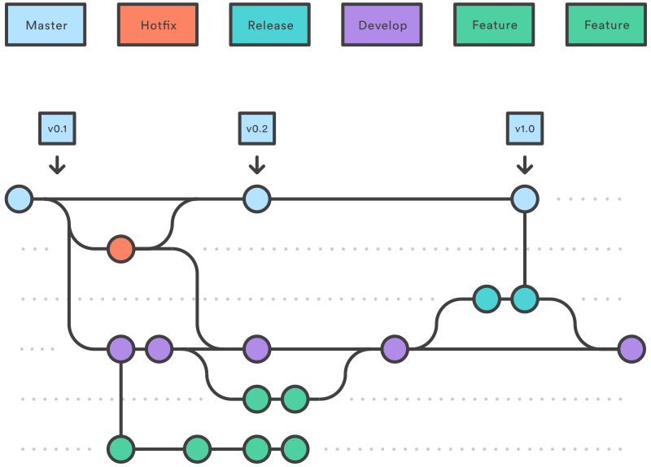

# Git 工作流

Git工作流是关于如何使用Git的方案，选用合适的工作流会大大提高工作效率。

## Centralized Workflow 集中式工作流

Centralized Workflow是最简单的工作流，直接把git当作svn来用。

开发人员总是在`master`分支上工作，并直接pull/push到远程主分支`origin/master`。

**注意，此方案只适用1~3人微型团队

### 示例

```
$ git add .
$ git commit
$ git pull
$ <resolve conflict if exist>
$ git push
```

## Feature Branch Workflow 功能分支工作流

Feature Branch Workflow为每一个feature创建一个新分支开发，相当于用branch对feature做一个封装，
可以有效防止未完成的功能污染主分支。

一般还会结合Web Server上额外的Pull Request功能来进行code review。

### 示例

```
$ git checkout master
$ git checkout -b new-feature
$ git add .
$ git commit
$ git push -u origin new-feature
$ <create PR on server>
```

### 分支的分支

如果一个feature又需要分成更多的sub-task，则我们可以再从feature branch创建更多的task branch。

这些task branch只对feature branch负责，即从feature branch checkout/merge，并merge into feature branch。

此时的feature branch仅作为task branch的基准，不应有任何merge以外的改动。
当feature完成后，feature branch可以直接merge到master而不需要review，因为所有diff都已经再`task -> feature`过程中被review。

## Gitflow Workflow

Gitflow在feature branch的基础上进行了拓展，又增加了更多分支种类

- master，主分支，包含了所有发行版本
- develop，开发分支，所有feature分支都base on开发分支
- feature，功能分支，与Feature Branch Workflow里概念相同，不同的是现在它对develop负责
- release，发布分支，当发布周期临近，创建release分支以释放develop分支使其可以接受下一个版本的功能，
后续release分支只接收bugfix并最终merge到master分支
- hotfix，热修复分支，当已发布的版本需要修订时创建的分支，一般热修复的改动同时也会merge回develop分支



### Release Branch 的例子

考虑现在已经创建了release branch `release/v1.0` (后简写作`v1.0`)，下一个版本为`v2.0`。

- 你的改动是否要进1.0版本？
    - 如果是，则须从`v1.0`checkout
        - 完成后，merge回`v1.0`，并同时merge回`develop`，即一般而言`develop`领先release分支
        - 在极其罕见的情况下，某些改动不需要merge回`develop`，此时会造成`v1.0`领先`develop`，则后续修改需要cherry-pick到`develop`
    - 如果不，则须从`develop`checkout
        - 无需关心`v1.0`分支，一切流程正常

## Forking Workflow

Forking Workflow引入了新的概念Fork，它表示一个仓库的分支。

这种工作流一般用于开源项目，因为开源，所以项目组的开发人员不固定。
当新的开发人员想要加入，他不是直接clone原始仓库，而是先fork一个自己的仓库然后clone。
这之后一切照旧，唯一的不同时最后创建的Pull Request的target时原始仓库

例如我想要向git贡献代码，则需要如下操作：

1. fork仓库`git/git`到自己的账户下`XDean/git`
2. Clone `XDean/git`到本地
3. 提交修改后push到`XDean/git`
4. 发起Pull Request：`XDean/git:master` -> `git/git:master`