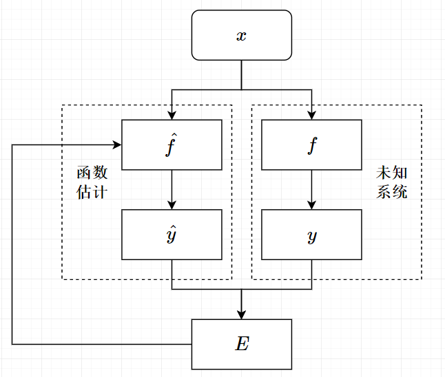
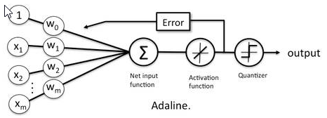

# Artificial Neural Network: Gradient Descent and Back Propagation

## Regression Analysis 回归分析

世界由数据（值）和过程（函数），而过程又有白盒和黑盒。对于黑盒的过程，我们虽然能够得到输入输出却不能确切了解到系统内部。例如

```
给定一幅10*10的像素图，问图中是数字几。（下记作P问题）（并指代一系列人脑可解机器不可解的问题）
```

这个简单的问题所有人脑都是一个实现，但是没有人可以用数字符号精确描述人脑是如何做到的。如何解析人脑构造似乎是脑科学家的工作，而统计学家（数据科学家）想要的只是以最低成本解答这一问题。这便开启了统计学回归分析的大门。(分类也可以看作是离散回归的一种，后文不作区分)



## Classic Regression methods 经典回归方法

- 在高中数学课本中我们都会有“最小二乘法”一节，学习的就是最简单的线性回归。我们构造一个线性过程来模拟目标过程，并用最小二乘法寻找最优解。
- 在高中生物选修课本中我们又会了解到用逻辑函数(Logistic function)来模拟预测生物种群数量变化
- 在大学概率论课程中我们又会学习到用泊松分布来模拟预测随机变量的分布和间隔

自19世纪初高斯发明改进最小二乘法以来，200年间有许许多多的回归方法被发明。但是很可惜的是，这些方法都难以解决P问题(其实有些方法可以解决)。因为各种方法是针对给定条件建立的特异性模型，这也是“数学建模”这一分支的职责。那么敢问数学建模专家，P问题该如何建模呢？

## Neural Network History 神经网络简史

对于P问题的解答科学家们从未停止研究。自1906年神经元研究获得诺贝尔奖，37年后的1943年，美国神经学家Warren McCulloch和数学家（逻辑学家）Walter Pitts首次提出了模拟神经元的M-P模型。他们的思想很简单，既然人脑可以解决P问题，我们为什么不模拟人脑的思考方式呢？


这就是神经网络的雏形。其主要可以用来解决逻辑运算和线性分类问题。

6年后，加拿大心理学家Donald Hebb提出了赫布学习方法来调整神经元之间的关联。他认为两个神经元若总是同时被激发，则其中之一会促进另一个的激发，类似于生物条件反射的形成。其调整方法如下

$$
\Delta\omega_{ij}=\eta\cdot a_i\cdot o_j
$$

即参数变化等于学习效率乘以输出神经元激活值诚意输入神经元输出值。赫布学习方法即是最早的神经网络训练方法。

1954年有人首次使用计算机模拟了一个赫布网络，4年后神经网络终于迎来了真正的应用，美国神经科学家Frank Rosenblatt对M-P模型进行改进，发明了感知机(Perceptron)，成功的在IBM-704上完成了感知机并用两年的时间实现了实现英文字母数字。同期，还有斯坦福教授Bernard Widrow开发的Adaline网络。



自此，神经网络领域进入了长达10年的发展阶段。
但是渐渐地人们发现（单层）神经网络能够处理的问题局限在二元线性可分问题，面对非线性我呢提，甚至连最基本的异或问题都无法解决。
在10年发展后神经网络陷入了15年无人问津的低迷期。

虽然接下来要着重介绍的反向传播方法(1974 Paul Werbos)正是出现在这一低迷期，但没有受到重视。

直到1982年，John Hopfield和Hinton, G. E相继设计了Hopfield神经网络和玻尔兹曼机。神经网络领域才迎来了新的浪潮。
他们采用全互联式神经网络和首次提出了隐含单元，层数的增加和神经元的互联为神经网络提供了更大的灵活性。但是参数的最优化解法已知是制约神经网络发展的最大问题。
于是被忽视的BP算法终于被唤醒，1986年David E. Rumelhart发表文章重新发布了这一算法，BP算法终于得到了重视，除了参数优化，还引入了可微分非线性神经元或是非线性激活函数来解决非线性问题。

随后一系列对BP算法的研究分析了BP神经网络对非线性函数逼近的性能，并证明了单隐层Sigmoid连续前馈神经网络可以任意精度逼近任意复杂的连续映射。

但是很遗憾的是，这一次热潮依然只持续了差不多10年。神经网络学习方法没有本质上的理论进展，对于简单的线性回归问题，被许多统计学方法(如支持向量机)全方位碾压。对于复杂问题，简单神经网络效果不好，复杂网络速度不好。神经网络领域再一次陷入低潮，等待着新的机遇。

神经网络再一次掀起浪潮已经是2006年，并一直持续到了今天。主要原因之一是因为计算能力(尤其是GPU)和存储能力的大幅提高，前者使得训练复杂模型成为可能，后者使得大量数据的训练集成为可能。神经网络在近10年的发展不再一一列举，而他的应用相信每个人都能有所感受，尤其是卷积神经网络在图像识别语音识别领域的应用切实改进了我们的生活。


*~值得一提的是，进入21世纪后人工神经网络有了一个新的名字——深度学习(Deep Learning)。深度学习这一名词对神经网络的品牌重塑有着不可或缺的作用。*

一下子扯了70年历史，让我们回到原来的问题上。神经网络最初是神经学家对人脑神经元结构的模拟，之后被用于解决回归问题。说到底，神经网络不过是诸多数学模型中的一种，用以解决特定问题，它从来不是解决一切问题的银弹。

在了解了机器学习的历史和他所要解决的问题之后，让我们进入正题，反向传播算法。

## Back Propagation 反向传播

“反向传播”全称应该叫做“误差反向传播”。

先让我们去掉“反向”，来看一看误差传播。这是概率论与数理统计中的概念，设有函数$y=f(x)$，对于存在误差的输入$x'=x+\Delta x$，一定会得到存在误差的输出$y'=y+\Delta y$，这就是误差传播。

那么回到我们的问题上，现在我们有$y=f_{\hat{\omega}}(x)$，其中$\hat{\omega}$为估计参数，有样本集$T$。假设存在$\omega$使得


## 梯度下降


## Temp

$$
\begin{aligned}
A_0 &= (a_{0,0}, a_{0,1}, \cdots , a_{0,n_0})^T \\\\
A_l &= (a_{l,0}, a_{l,1}, \cdots , a_{l,n_l})^T \\\\
&= Sigmoid(NET_l) \\\\
&= Sigmoid( \Omega_l \times A_{l-1} + b_l ) \\\\
a_{l,i} &= Sigmoid(net_{l,i}) \\\\
&= Sigmoid(\sum_{k=0}^{n_{l-1}}\omega_{l,k,i} + b_l) \\\\
E &= \sum_{k=0}^{n_L}(a_{L,k}-t_k)^2 / 2
\end{aligned}
$$

$$
\begin{aligned}
\Delta_{l,i,j}=\frac{\partial E}{\partial \omega_{l,i,j}} &= \frac{\partial E}{\partial a_{l,j}} \frac{\partial a_{l,j}}{\partial net_{l,j}} \frac{\partial net_{l,j}}{\partial \omega_{l,i,j}} \\\\
&= \frac{\partial E}{\partial a_{l,j}} \frac{\partial Sigmoid(a_{l,j})}{\partial a_{l,j}} a_{l-1,i} \\\\
&= \frac{\partial E}{\partial a_{l,j}} a_{l,j} (1 - a_{l,j}) a_{l-1,i} \\\\
{\rm If} \quad l = L \\\\
\frac{\partial E}{\partial a_{L,j}} &= a_{L,j} - t_j \\\\
{\rm If} \quad l \not= L \\\\
\frac{\partial E}{\partial a_{l,j}} &= \frac{\partial E(net_{l+1,0}, net_{l+1,1}, \cdots , net_{l+1,n_{l+1}})}{\partial a_{l,j}} \\\\
&= \sum_{k=0}^{n{l+1}}\frac{\partial E}{\partial net_{l+1,k}}\frac{\partial net_{l+1,k}}{\partial a_{l,j}} \\\\
&= \sum_{k=0}^{n{l+1}}\frac{\partial E}{\partial net_{l+1,k}}\omega_{l,j,k} \\\\
{\rm Let} \quad  \Delta_{l,i,j}=\delta_{l,j}a_{l-1,i} \\\\
\delta_{l,j}&=\begin{cases}
(a_{L,j} - t_j)a_{L,j}(1-a_{L,j}),\quad l=L \\\\
\sum_{k=0}^{n{l+1}}\delta_{l+1,k}\omega_{l,j,k}a_{l,j}(1-a_{l,j}), \quad l \not= L
\end{cases} \\\\
\end{aligned}
$$

## Reference

1. [Principles of training multi-layer neural network using backpropagation](http://galaxy.agh.edu.pl/~vlsi/AI/backp_t_en/backprop.html)
2. [Wiki-Backpropagation](https://en.wikipedia.org/wiki/Backpropagation)
3. [一文弄懂神经网络中的反向传播法——BackPropagation](https://www.cnblogs.com/charlotte77/p/5629865.html)
