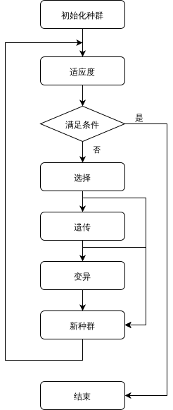
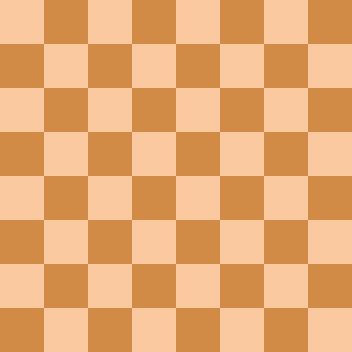
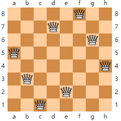
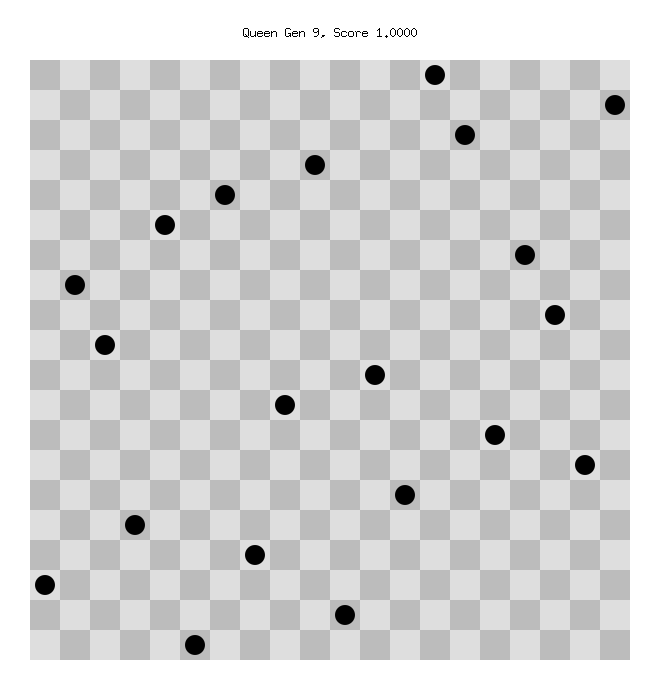
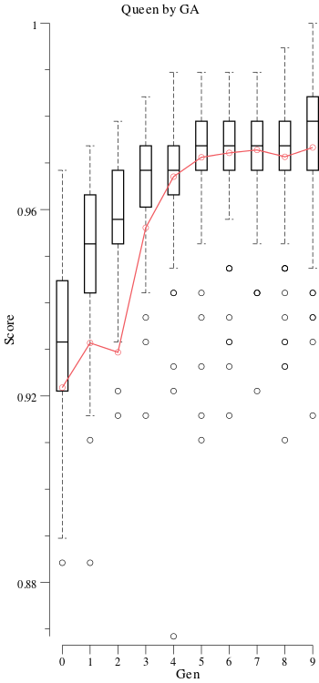
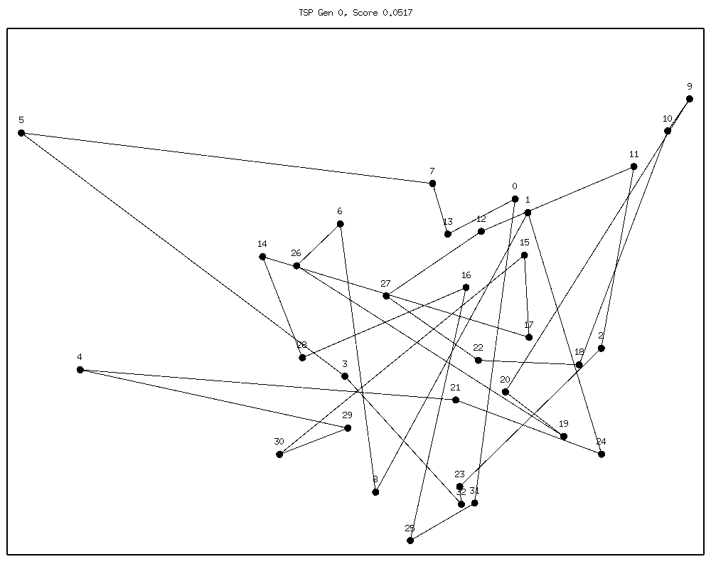

# Genetic Algorithm

## Introduce

遗传算法（英语：genetic algorithm (GA) ）是计算数学中用于解决最优化的搜索算法，是进化算法的一种。进化算法最初是借鉴了进化生物学中的一些现象而发展起来的，这些现象包括遗传、突变、自然选择以及杂交等。

遗传算法通常实现方式为一种计算机模拟。对于一个最优化问题，一定数量的候选解（称为个体）可抽象表示为染色体，使种群向更好的解进化。传统上，解用二进制表示（即0和1的串），但也可以用其他表示方法。进化从完全随机个体的种群开始，之后一代一代发生。在每一代中评价整个种群的适应度，从当前种群中随机地选择多个个体（基于它们的适应度），通过自然选择和突变产生新的生命种群，该种群在算法的下一次迭代中成为当前种群。

### Problem Domain

全局最优化问题

## Methodology

### Concepts

- 基因(Gene)
- 个体(Individual)
- 种群(Population)
- 适应度(Fitness)
- 选择(Selection)
- 遗传/交叉(Crossover)
- 变异(Mutation)

### Flow



## Samples

### [N Queen Puzzle](https://en.wikipedia.org/wiki/Eight_queens_puzzle)

在N*N棋盘上放置N个皇后，任意两皇后不互相攻击。

#### Classic Solution

回溯法(穷举)，时间复杂度$O(k^N) ~ O(N^N)$
<sub>[*参考](https://sites.google.com/site/nqueensolver/home/algorithm-results)</sub>



#### GA Solution

##### Encode

用一个长度为N的数组记录一个候选组合。显然每一行只能放一个皇后，即每一个候选组合为N的一个排列。

如 `[5, 3, 1, 7, 2, 8, 6, 4]`



##### Fitness

对于候选组合中的每两个皇后，如果不相互冲突则适应度+1，如对于四皇后

```
[2, 1, 4, 3]

+o++
o+++
+++o
++o+
```

有适应度4

##### Crossover

皇后的交叉不能采用简单的分段交叉，因为很可能会产生平凡的错误组合

```
  [1, 2, 3, 4, | 5, 6, 7, 8]
+ [5, 6, 7, 8, | 1, 2, 3, 4]
---------------|------------
= [5, 6, 7, 8, | 5, 6, 7, 8]
```

这里采用公共子集交叉，即


```
  [1, 2, 3, 4, 6, 5, 8, 7]
+ [2, 3, 4, 1, 8, 5, 7, 6]
--------------------------
= [2, 3, 4, 1, 6, 5, 8, 7]
```

亲本中有公共子集`1,2,3,4`和`6,7,8`，进行交叉

##### Mutation

皇后的变异也显然不能只改变一位，这里我们采用随机交换两皇后的行

```
[1, 2, (3), 4, 6, 5, (8), 7]

[1, 2, (8), 4, 6, 5, (3), 7]
```

##### Other Params

```go
genetic.Population{
    Size:            100,  // 种群大小
    Dim:             N,    // 基因数量，N皇后
    CrossoverFactor: 0.8,  // 交配概率 
    VariantFactor:   0.2,  // 变异概率
    MaxGen:          5000, // 最大代数

    TargetFunc:    genetic.TargetScore(1), // 目标适应度1
    RandomFunc:    Random,                 // 随机生成N皇后
    CrossoverFunc: CrossoverRing,          // 按公共环交叉
    VariantFunc:   Variant,                // 交换变异
    ScoreFunc:     ScorePower(1),          // 适应度(正规化后)
    SelectFunc:    genetic.ScoreOrderSelectTop(0.1, 0.9), // 选择函数
}.Random().Run() // 随机初始化后开始迭代
```

##### Result

以20皇后为例





对比传统方法(寻找一组解)

- 回溯法
    - 13 皇后 1.65s
    - 14 皇后 13.32s
    - 15 皇后 117.56s
- GA
    - 20 皇后 平均<15ms
    - 50 皇后 平均<100ms
    - 100 皇后 平均<500ms
    
### Travel Sale Problem

#### Classic Solution

动态规划，时间复杂度$O(n^2 \cdot 2^n)$，找到最优解

#### GA Solution

**无法找到最优解**

##### Encode

为所有N个点编号，一组候选组合即为N的一个排列

##### Fitness

距离越小，适应度越高，故取距离倒数

##### Crossover

一种常规的优化是交换两个连接，如

```
[1, 3, 2, 4]

1     2
|\   /|
| \ / |
|  x  |
| / \ |
|/   \|
4     3

TO

[1, 2, 3, 4]

1-----2
|     |
|     |
|     |
|     |
4-----3
```

即将一个子序列倒序

##### Mutation

变异的方法同理，随机选取子序列进行倒序

##### Other Params

```go
genetic.Population{
    Size:            100,
    Dim:             len(tspMap),
    CrossoverFactor: 0.8,
    VariantFactor:   0.2,
    MaxGen:          2000,

    TargetFunc:    genetic.TargetStableScore(100),
    RandomFunc:    Random(&tspMap),
    CrossoverFunc: CrossoverNearestRevert(-2),
    VariantFunc:   VariantRevertSwap,
    ScoreFunc:     ScoreDistancePow(-1),
    SelectFunc:    genetic.ScoreOrderSelectTop(0.1, 0.8),
}.Random().Run()
```

##### Result

测试寻找中国32座主要城市最短路径，平均200ms，最短距离<160(约17500km)



### GA + ANN

["如何丝滑地入门神经网络？写个AI赛车游戏，只训练4代就能安全驾驶_知乎"](https://zhuanlan.zhihu.com/p/56319305 )