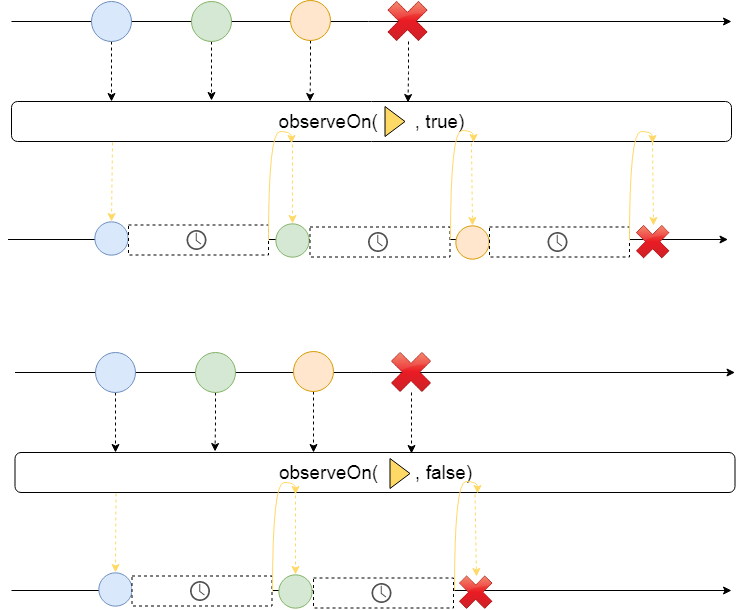

# Scheduler

RxJava 为我们提供了两个调度操作符`subscribeOn`和`observeOn`.

## How they work

## Delay error

## Schedulers

- `computation`
- `io`
- `single`
- `newThread`
- `trampoline`

[Sample Code](/src/main/java/xdean/share/rx/ReactiveChapter3.java)

| Previous | Next |
| --- | --- |
| [Operator](2-Operator.md) |  |